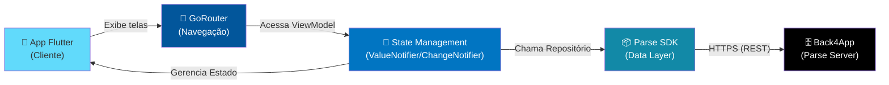
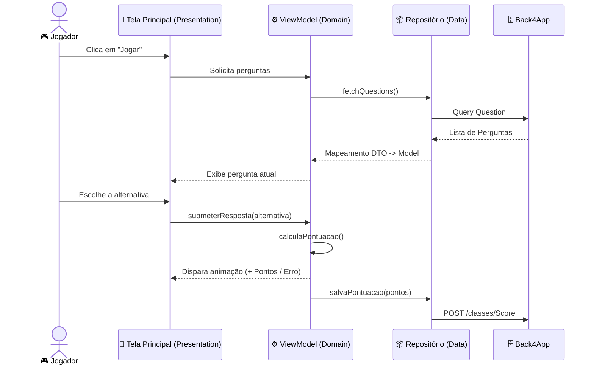
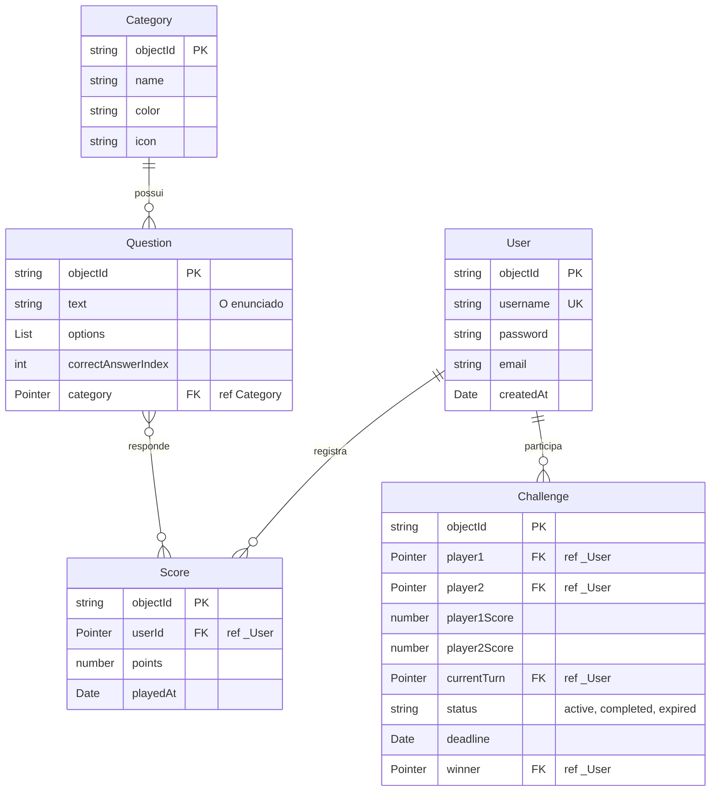

# 🏛️ Arquitetura do Perguntados

Este documento descreve a arquitetura técnica do aplicativo Perguntados em Flutter, incluindo fluxos, modelo de dados e decisões técnicas, de acordo com as regras estabelecidas no nosso guia.

---

## 📐 Visão Geral

O projeto Perguntados segue o padrão arquitetural **MVC/MVVM** e uma organização por **Camadas Lógicas** claras (Presentation, Domain, Data, Core), garantindo desacoplamento, facilidade de testes e manutenção.

### Camadas Lógicas do Projeto (`lib/`)

1. **`Presentation`**: Contém a interface do usuário (Widgets e Telas). Onde reside a camada de visualização. Mantém o UI focado apenas em exibir o dado e repassar interações para o estado ou ViewModel correspondente.
2. **`Domain`**: Onde residem as regras de negócio puras (ex: cálculo de pontos baseado na dificuldade).
3. **`Data`**: Modelos de entidades, clientes de API (integração com Back4App) e Repositórios.
4. **`Core`**: Recursos compartilhados (temas visuais com Material 3, utilitários, tratamento de exceções, extensões, etc).

---

## 🎮 Fluxo de Jogo e Pontuação

---

## 🗄️ Modelo de Dados (Back4App)

O backend é abstraído usando o SDK do Parse. Os objetos no aplicativo mapeiam diretamente para Classes no painel do Back4App.

---

## 🎨 Decisões Técnicas e Boas Práticas

### Gerenciamento de Estado e Reatividade
- **Soluções Nativas:** Sempre preferimos utilizar `ValueNotifier`, `ChangeNotifier`, `Streams` e `Futures` do próprio ecossistema Dart para manter a árvore de dependências leve e diminuir a complexidade.
- **Componentes Imutáveis:** Priorizamos a composição de `StatelessWidget`.

### Rotas e Navegação
- **GoRouter:** Escolhido por permitir roteamento declarativo e fácil integração de fluxos de redirecionamento (ex: redirecionar para tela de Login caso não esteja autenticado).

### Qualidade de Código (Lint e Formatação)
- Limite de 80 caracteres por linha.
- Uso mandatório de classes em `PascalCase`, membros em `camelCase` e arquivos em `snake_case`.
- Análise sintática e semântica através do comando `flutter analyze` e ferramenta `dart_fix` para auto-correções comuns.

### Testes
- A camada de `Domain` e `Data` deve ser inteiramente testável utilizando Mocks, Fakes ou Stubs (preferencialmente Fakes). Para testes mais complexos de simulação, utiliza-se o package `mockito` ou `mocktail`.
- Utilizamos o padrão de teste **Arrange-Act-Assert** ou **Given-When-Then**.

---

**[← Voltar ao README](./README.md)**

