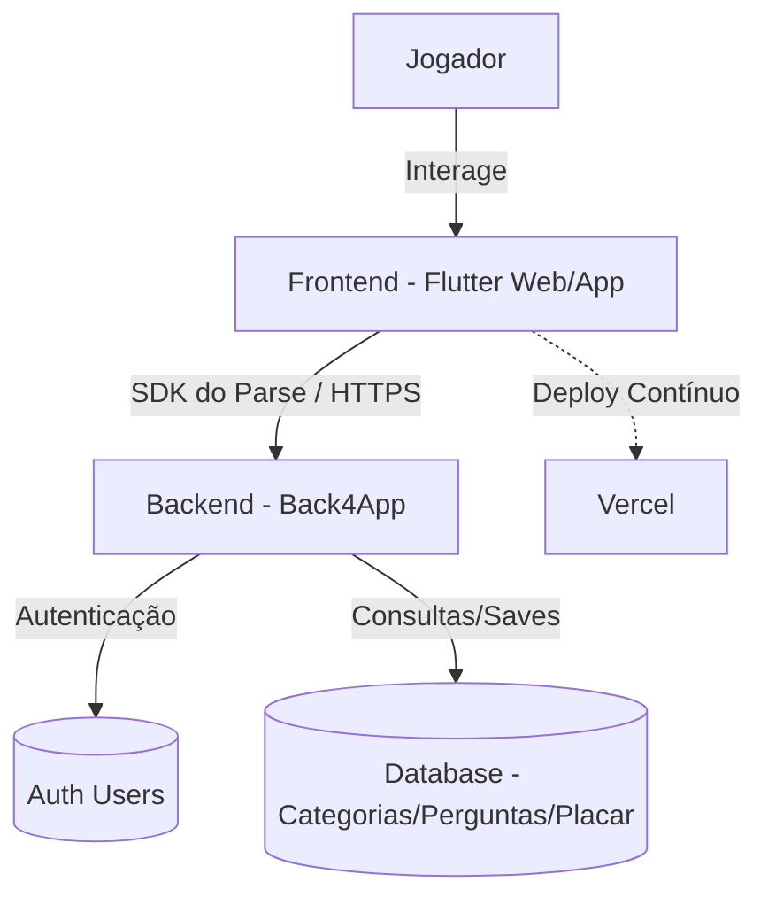

# Arquitetura da Aplicação - Perguntados

O diagrama abaixo ilustra a arquitetura da aplicação "Perguntados", integrando o frontend desenvolvido em Flutter com o backend fornecido pelo Back4App, e o deploy via Vercel.

## Estrutura de Versionamento

- `main`: Branch principal, espelha o código em produção na Vercel.
- `dev`: Branch de integração, contendo as últimas alterações em desenvolvimento.
- `feature/*`: Branches específicas para o desenvolvimento de novas funcionalidades (ex: `feature/login`, `feature/tela-perguntas`).

O fluxo de trabalho utilizará Pull Requests da `feature` para a `dev`, garantindo revisão de código antes da integração.
